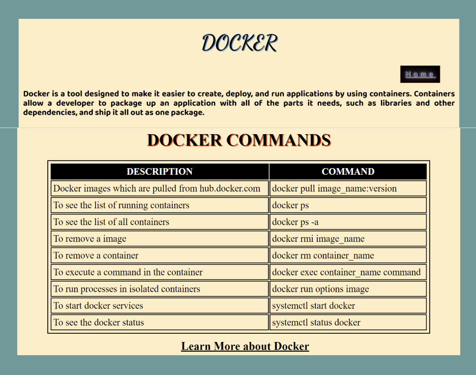

## Welcome to GitHub Pages
#### Task 07 👨🏻‍💻
##### Javascript Integration with Docker
Task Description 📄
📌 In this task you have to create a Web Application for Docker (one of the great Containerization Tool which provides the user 
Platform as a Service (PaaS)) by showing your own creativity and UI/UX designing skills to make the webportal user friendly.
📌 This app will help the user to run all the docker commands.





### Markdown

Markdown is a lightweight and easy-to-use syntax for styling your writing. It includes conventions for

```markdown
Syntax highlighted code block

# Header 1
## Header 2
### Header 3

- Bulleted
- List

1. Numbered
2. List

**Bold** and _Italic_ and `Code` text

[Link](url) and 
```

For more details see [GitHub Flavored Markdown](https://guides.github.com/features/mastering-markdown/).

### Jekyll Themes

Your Pages site will use the layout and styles from the Jekyll theme you have selected in your [repository settings](https://github.com/AishwaryaBirla/docker_webUI/settings/pages). The name of this theme is saved in the Jekyll `_config.yml` configuration file.

### Support or Contact

Having trouble with Pages? Check out our [documentation](https://docs.github.com/categories/github-pages-basics/) or [contact support](https://support.github.com/contact) and we’ll help you sort it out.
